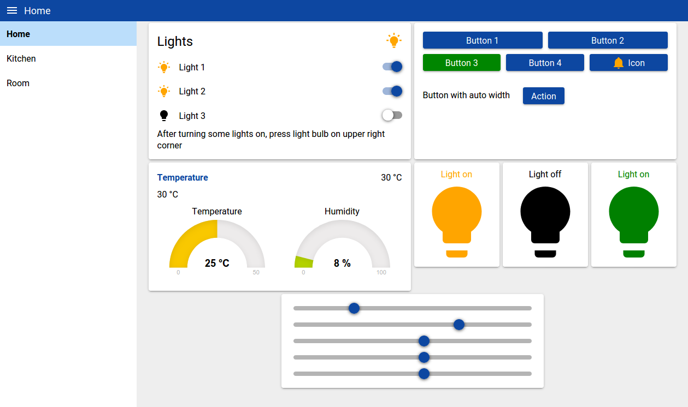
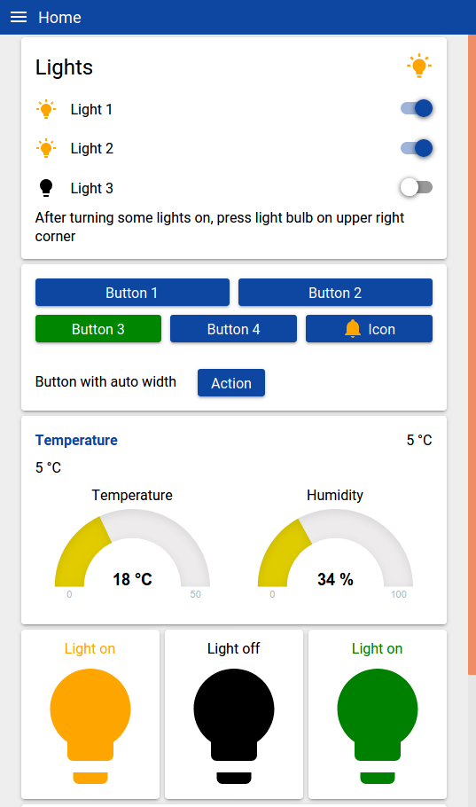

# Yet Another Node-Red Dashboard (yad)
A Node-RED dashboard based on web-components.

This package allows you to create dashboard widgets as web-components that are accompanied their own Node-RED node.
Being a web-component, a widget becomes an HTML-tag.

Building the dashboard then means to design an HTML page, i.e. plugging together HTML-tags and styling them with CSS.
The widgets automatically send and receive messages to/from Node-RED.


## UPDATE
The current version has been updated significantly.
The main reason for this was to get rid of polymer 3, which is not developed any further.
This meant that all widgets had to be rewritten. Instead of again relying on a framework to generate the widgets, most widgets are now native web-components, meaning no dependencies at all.
There is one exception, the `yad-app-drawer-layout` widget is created with [lit-element](https://lit-element.polymer-project.org/).
Furthermore, new widgets have been introduced, like a slider, a more advanced switch/toggle and a gauge widget.
The behavior of the new widgets is similar, but not equivalent.

# Installation
Go to your Node-RED user folder (e.g. ~/.node-red) and run
```
npm install --save cinhcet/node-red-contrib-component-dashboard
```

# Creating a Dashboard
The following assumes that `userDir` is the user directory of your Node-RED install and Node-RED can be reached at `http://127.0.0.1:1880`.

You can create as many independent dashboards as you want.
Each separate dashboard is represented by a configuration node, called `yad-configuration`, which has a single property `name`.

When a new yad-configuration node is created with, for example, name `yad`, a new folder in your Node-RED user directory will be created `userDir/yad/yad`. There you can find `index.html, style.css, widgets.js`. With these files, you create your dashboard.


## Bundling
Everytime a file in `userDir/yad/yad` is changed or the first time a new yad-configuration node has been created, you need to run
```
node bundle.js
```
in `userDir/yad/yad`.
This will invoke [parcel.js](https://parceljs.org/) to bundle your dashboard files to `userDir/yad/yad/dist`, which usually is fast, but takes a few seconds for the first time.
If you run
```
node bundle.js watch
```
then it watches automatically for changes in your files.
For debugging purposes, you can turn off minification (option `noMinify`) or create source maps (option `sourceMaps`).

## Dashboard URL
After bundling, the dashboard can be reached at `http://127.0.0.1:1880/yad`

## Example
The template that is copied automatically when a new dashboard is basically empty.
To get started, locate the `node-red-contrib-component-dashboard` module, most probably be found in `userDir/node_modules/node-red-contrib-component-dashboard` and then go to the folder `node-red-contrib-component-dashboard/templates/exampleDashboard_1` where you can find an example flow `flows.json` you can import into Node-RED.
After deployment, copy all files (except `flows.json`) from `node-red-contrib-component-dashboard/templates/exampleDashboard_1` to `userDir/yad/yad` and run the bundling (`node bundle.js`). This will give you a basic dashboard at `http://127.0.0.1:1880/yad`.


# Creating widgets
The best way to create your own widgets is to look at the widgets delivered with the package and to learn about web-components.
If you can create your widget as a web-component, then interfacing it with Node-RED via the provided helper functions is really easy.

Writing native web-components is a good exercise and for simple widgets like a button makes a lot of sense. However, when creating more involved widgets you very quickly want to have two things: 1) a way to deal with the properties and attributes of the component (or more precisely to sync them) and 2) a template engine.
Exactly these two requirements are provided by [lit-element](https://lit-element.polymer-project.org/), which is a really light-weight library and not a framework that helps you to reduce the boilerplate code in writing web-components and has a very nice template engine, called `lit-html`.
Of course, you could also use other web-component libraries.

## Note
This is still a proof of concept, although I am using it for quite some time now without any issues.

Feedback/discussion is appreciated. Please do not hesitate to contact me, e.g. via github issues or in the Node-RED forum!

## Update guide
The current version does not include the old polymer 3 widgets anymore. If you still want to use them, install
https://github.com/cinhcet/node-red-contrib-component-dashboard-legacy-widgets
via
```
npm install --save cinhcet/node-red-contrib-component-dashboard-legacy-widgets
```
in your Node-RED user directory.
Then update the imports in `widgets.js` to point to those old widgets.
It is highly recommended to update to the new widgets, which should not take an unreasonable amount of time.

## Browser support
Only modern browsers (i.e. no IE 11) are supported. If IE 11 is needed, it is possible to import the web-component polyfill.
I have only tested on firefox and chrome. Feedback appreciated.

## Some images




## Why another dashboard?
The standard dashboard for Node-RED [node-red-dashboard](https://flows.nodered.org/node/node-red-dashboard) is very convenient. You can create dashboards directly from Node-RED. However, this convenience also implies less flexibility (e.g. you have to use angularjs).

When this project started, it was also not possible to create new widgets for node-red-dashboard, which is now possible.
But still, I need more flexibility in creating my dashboards, for example to integrate a music browser/player into it.
Then I came across [node-red-contrib-uibuilder](https://github.com/TotallyInformation/node-red-contrib-uibuilder), which is somehow the complete opposite of node-red-dashboard. It gives you a lot of freedom in developing your dashboard and helps you to establish the connection to Node-RED. However, what I personally don't like is that all the communication goes to one single Node-RED node, not like with node-red-dashboard, where every widget has its own node.

Therefore, I created this dashboard, which is called node-red-contrib-component-dashboard, or in short **yad** for YetAnotherDashboard. This is somehow in between node-red-dashboard and node-red-contrib-uibuilder in the sense that you have the freedom of creating your dashboard as you want, but at the same time have the convenience that every widget on the dashboard has its own node in Node-RED.


## Acknowledgements
This dashboard was inspired by
* [node-red-contrib-uibuilder](https://github.com/TotallyInformation/node-red-contrib-uibuilder) from TotallyInformation
* [node-red-dashboard](https://flows.nodered.org/node/node-red-dashboard) from the Node-RED team
* [node-red-contrib-polymer](https://www.npmjs.com/package/node-red-contrib-polymer) from hobbyquaker
